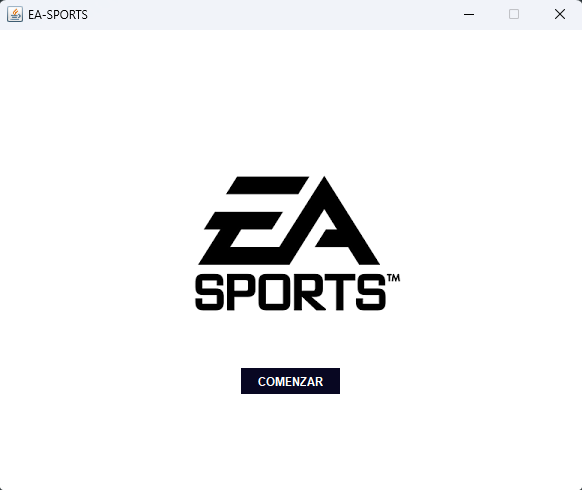
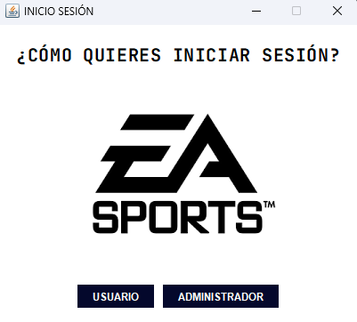

# 📚 Índice

- [Descripción](#-gestión-de-competiciones-e-sport)
- [Colaboradores](#-colaboradores)
- [Tecnologías Utilizadas](#-tecnologías-utilizadas)
- [Instalación](#-instalación)
- [Uso](#-uso)
- [Capturas](#-capturas)
- [Tests](#-tests)
- [Estado del Proyecto](#-estado-del-proyecto)

---

# 🎮 Gestión de Competiciones E-Sport

Aplicación pensada para gestionar competiciones de E-Sport. Permite registrar equipos y jugadores, generar automáticamente el calendario de enfrentamientos y guardar los resultados de cada jornada.

Tiene dos tipos de usuarios:

- 🛠️ **Administradores**: gestionan equipos, jugadores, calendario y resultados.
- 👥 **Usuarios normales**: pueden consultar informes.

---

# 👨‍💻 Colaboradores

- Unax Iriondo  
- Yassir Santiago  
- Imanol Manero  
- Aimar Medina  

---

# 🧰 Tecnologías Utilizadas

      
      
  

---

# 🔧 Instalación

1. Clona el repositorio:
   ```bash
   git clone https://github.com/Equipo-4-EA-SPORTS/EA-sports.git
   ```

2. Abre el proyecto en IntelliJ IDEA o cualquier IDE compatible.

3. Configura la conexión a la base de datos Oracle.

4. Ejecuta la clase principal para iniciar la aplicación.

---

# ▶️ Uso

- **Inicio de sesión** según tipo de usuario:
  - Usuario administrador:
    - Contraseña: admin1
    - Nombre: admin1
  - Usuario normal:
    - Contraseña: usr1
    - Nombre: usr1
- **Administradores** pueden:
  - Registrar/editar equipos y jugadores.
  - Generar calendario de partidos.
  - Ingresar resultados.
- **Usuarios normales**:
  - Pueden consultar informes y resultados.

---

# 📸 Capturas

Esta es la pantalla principal de la aplicación, donde se muestra el logo de EA Sports y el botón para comenzar.



En esta ventana se muestran dos opciones
  - Inicio de sesion como usuario
  - Inicio de sesion como adminstrador




---

# 🧪 Tests

- Se usó **JUnit 5** para pruebas unitarias.
- Clases testeadas:
> Añadir clases en las que se han hecho los test.

---

## 🚀 Estado del Proyecto

✅ Proyecto en construcción

---


